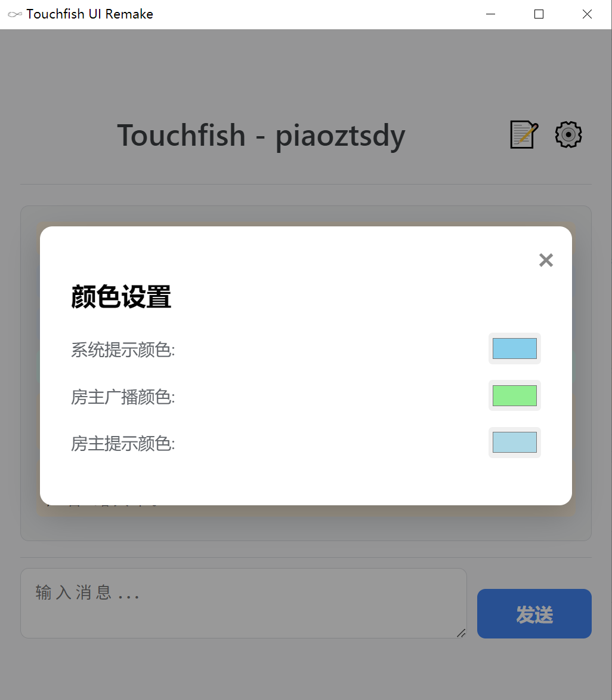

# Touchfish Client - Electron Edition


这是一个基于 Electron 重新构建的聊天客户端，旨在提供一个更美观、现代且功能完整的聊天体验。它与原有的 Python 服务器兼容。

## 截图
1.3.3更新内容:
---
添加了提交bug功能\


1.3.2更新内容:
---


1.3.1的内容：
---
(不要管底下的版本)\




## 功能特点

* **现代用户界面**：采用简洁风格设计，提供更美观的视觉体验。
* **连接服务器**：支持连接到自定义 IP 和端口的 Python 聊天服务器。
* **实时聊天**：发送和接收文本消息。
* **多行输入**：消息输入框支持多行文本输入。
* **自定义颜色**：可在设置中自定义系统消息、房主广播和房主提示的颜色。
* **版本信息**：显示当前客户端版本和从服务器获取的最新版本。

## 开始使用

### 前置条件

在运行此应用之前，请确保您的系统已安装以下软件：

* **Node.js**: (推荐 LTS 版本)
* **npm**: (Node.js 安装时通常会一同安装 npm)
* **Python 聊天服务器**: 本客户端需要连接到一个兼容的 Python 聊天服务器才能正常工作 (推荐官方的 bopid.cn:7001)。

### 安装

1.  **克隆仓库**

2.  **安装依赖**:
    在项目根目录运行以下命令安装所有必要的 Node.js 依赖：
    ```bash
    npm install
    ```

### 运行应用

在安装完所有依赖后，您可以通过以下命令启动 Electron 客户端：

```bash
npm start
```

## 还没写完哦，欢迎帮写~